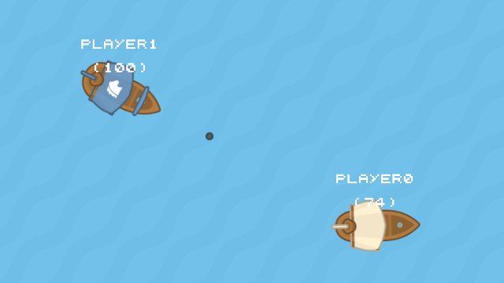

# GUERRA DE BARCOS

Para iniciar el servidor ejecutar la siguiente instrucción:  
- `npm run start`  

Para unirse a la partida, se debe ingresar con un navegador a la dirección ip del servidor y el puerto, ejemplo:
- `123.456.789.0:8000`  
# Controles
- Para mover el barco se debe presionar la tecla "W" y el barco avanzara hacia donde apunte el mouse.
- Para disparar se debe hacer click izquierdo y la bala saldra hacia donde apunte el mouse.
# Observaciones
El servidor escucha por defecto en el puerto **8000**, puedes definir un puerto diferente como variable de entorno **PORT**.

